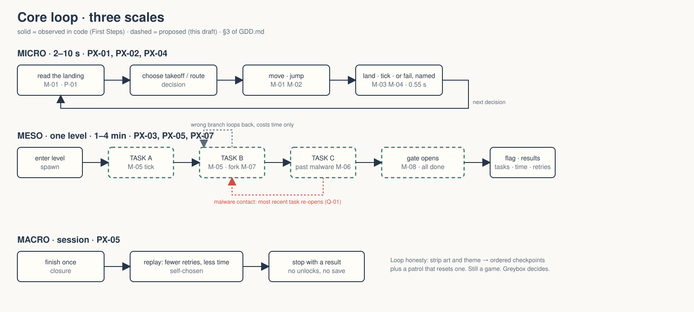
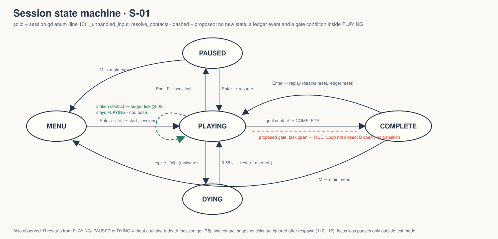
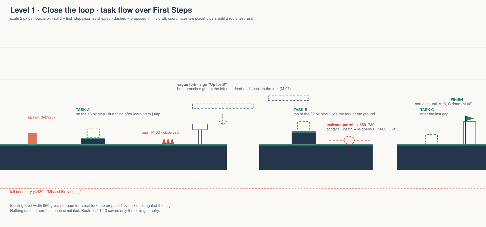
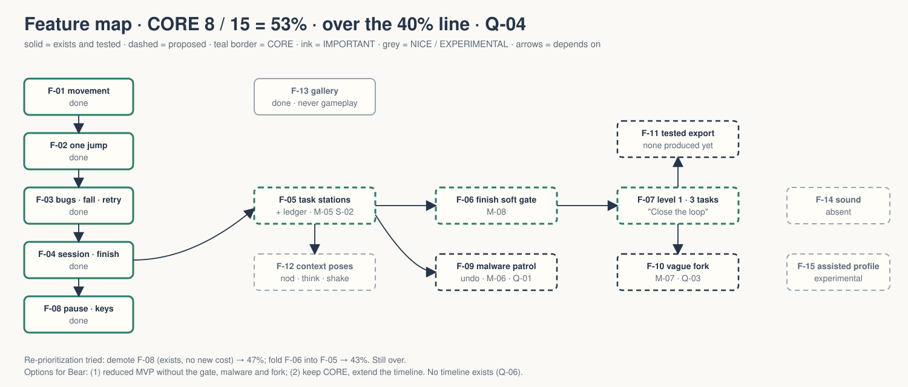

# walker-jumpman-clawd — Game Design Document

| | |
|---|---|
| Version | 0.3.0-draft |
| Date | 2026-09-18 |
| Author | Zelda (agent draft), for Bear |
| Mode | recovered + draft overlay, silent |
| Revision | 1 |
| Gates | vision ○ · systems ○ · world ○ · scope ○ (none signed) |
| Supersedes | root `GDD.md` 0.2.0 (walker-jumpman starter, historical) |

Provenance tags: `[OBSERVED path:line]` the code does this · `[INFERRED]` the code implies this · `[ASSUMPTION]` Zelda decided this to make the draft whole · `[MISSING]` nobody has decided this. Every proposed element is dashed in the diagrams; every observed one is solid.

*`[OBSERVED]` evidence/clawd/game.png. Two zones, one spike, one gap visible, finish off-screen right. This is the whole shipped game today.*

## 1. Vision summary

**Logline.** Clawd the coding agent runs every level as an agentic loop, finishing ordered tasks while bugs, malware and vague instructions try to stop the loop from closing.

**Player fantasy.** "I am the agent. I close the loop." Not a superhero; a worker who finishes despite conditions. `[ASSUMPTION]`

**Player.** Keyboard players who know or are learning what a coding agent does. First-play session under five minutes. `[ASSUMPTION]` The starter's audience hypothesis was "short readable platforming challenge" `[INFERRED GAME-BRIEF.md]`; this draft narrows it.

**The promise.** Every failure names its cause in one line. Every level ends with the loop closed and a receipt: tasks done, retries, time. `[OBSERVED session.gd:154 death_reason; hud.gd:48 results line]`

**The whole game.** Menu, one or more levels, each a loop of tasks, finish, results, replay. No accounts, combat, inventory, economy, or metagame. `[INFERRED project scope; ASSUMPTION for multi-level]`

**Biggest unresolved question.** Does malware undoing a task feel like a setback worth avoiding or a punishment that kills the "one more try" promise? Q-01.

## 2. Design pillars

| ID | Pillar | Protects | Honors it | Violates it | If ignored |
|---|---|---|---|---|---|
| P-01 | Read the landing | Knowing where you will land before you commit | Every landing visible before takeoff `[OBSERVED LEVEL-DESIGN.md acceptance]` | A blind jump | Failure feels arbitrary |
| P-02 | Earn another try | Wanting to retry because the failure is legible | 0.55 s reset, cause on screen `[OBSERVED session.gd:137,154]` | Lives, long death screens, silent resets | Player quits before learning |
| P-03 | Close the loop | Feeling progress inside a level, not only at the flag | Ordered task stations with a visible ledger `[ASSUMPTION]` | Tasks that are just collectibles with no order or consequence | Level is a corridor with a checklist stapled on |
| P-04 | Small, complete game | A coherent beginning, challenge and end | One finished level with results and replay `[OBSERVED]` | Half-built mechanics from the animation gallery | A demo menu instead of a game |

**Pillar collision test.** P-01 versus the vague-path obstacle: an obstacle about ambiguity wants to hide information; P-01 forbids hiding landings. Ruling: vague paths hide *which branch is right*, never *where the platform is*. P-01 is PRIMARY. Any vague path that hides a landing is a P-01 violation and is cut. `[ASSUMPTION, logged D-01]`

P-02 versus malware undoing a task: undoing work is a bigger loss than a death, and P-02 says the loss must stay legible and cheap. Ruling: malware undoes at most one task, the HUD shows which, and the station is reachable again without a death. P-02 is PRIMARY. `[ASSUMPTION, Q-01]`

## 3. Core loop

**Micro (2–10 s).** Read the next landing or station → choose route and takeoff → move, jump → land, complete a task, or fail with a named cause → next decision. Deciding: where to land, whether to commit. Risk: the attempt's position and any not-yet-banked task. Reward: a landing, a task ticked. `[OBSERVED movement/hazard/finish; ASSUMPTION task tick]`

**Meso (one level, 1–4 min).** Enter the loop → task A → task B → task C → finish gate opens → flag. Deciding: route through obstacles, whether to take the vague-path fork. Risk: malware undoing a task, time lost on a wrong branch. Reward: a closed loop and a receipt. `[ASSUMPTION]`

**Macro (session).** Finish once → replay for fewer retries or less time → stop with a complete result. No persistent unlocks. `[OBSERVED hud.gd:46-48 results; INFERRED no save code exists]`

**Loop honesty test.** Strip Clawd's art, the agent framing, and the task names. Left: a readable platformer with ordered checkpoints and a patrolling hazard that resets one checkpoint. That is still a game with decisions. The theme adds meaning, not mechanics. Passes, provisionally; the greybox decides. `[ASSUMPTION]`

## 4. Player Experience Goals

| ID | The player should feel… | when… | Serves | Tested by |
|---|---|---|---|---|
| PX-01 | in control | a planned jump lands where expected | M-01, M-02 | T-01..T-06 `[OBSERVED tests/test_game.gd]` |
| PX-02 | that they understand the mistake | a bug, fall or malware ends an attempt and the HUD names it | M-04 | T-09..T-11, human H-01 |
| PX-03 | progress inside the level | a task station ticks on the ledger | M-05 | T-20 (new), H-02 |
| PX-04 | that they want one more try | control returns in under a second after failure | M-04 | T-10 |
| PX-05 | closure | the loop closes and the results say tasks, time, retries | M-08 | T-12, T-13 |
| PX-06 | able to play without sound or color | keyboard-only, muted | M-09 | T-14..T-16 |
| PX-07 | that a wrong branch was their read, not a trick | a vague path sends them the long way and the sign was ambiguous but fair | M-07 | H-03 `[MISSING test]` |

**Feature filter.** Serves PX-03: task stations. Serves none: the 18-animation gallery as a gameplay feature. It stays a separate diagnostic scene `[OBSERVED gallery/clawd_gallery.gd:2]`; flagged as bloat risk if anyone proposes wiring it in.

## 5. Mechanics

### M-01 Move and stop `[OBSERVED]`
Problem: legible horizontal control. How: axis from `move_left`/`move_right`, accelerate at 1280 px/s² toward ±160 px/s, decelerate at 1920 px/s² `[OBSERVED player.gd:59-60, tuning.gd]`. Left wall at x=10 `[player.gd:70]`. Pillars P-01. Loop: micro. Edge cases: both directions held → zero velocity `[T-04]`; direction change mid-air allowed, no air penalty; pushing into a wall holds position. Scope: no dash, no wall interaction. Godot owner: `features/player/player.gd`, CharacterBody2D, layer 2 mask 1 `[player.gd:23-24]`.

### M-02 Jump with modest forgiveness `[OBSERVED]`
Problem: one honest jump. How: jump velocity −320 px/s, gravity 960, terminal 480; 6-tick coyote and 6-tick buffer; one jump per floor contact; held jump does not re-fire `[player.gd:52-68]`. Rise ≈ 53.3 px `[T-06 asserts]`. Pillars P-01. Edge: low ceiling clips the arc and still counts as one jump `[T-08]`; jump pressed during pause is discarded on resume `[session.gd:124-125]`; coyote after walking off an edge, not after a jump. Scope: no double jump, no variable height. Owner: same script.

### M-03 Bug hazard `[OBSERVED, renamed]`
Problem: a stationary, visible cost for a bad landing. How: three exact triangular triggers per hazard, layer 8, contact ends the attempt with "Watch the spikes" `[session.gd:83-89,154]`. Pillars P-01, P-02. Edge: arm art overlapping a spike without collider contact is not a death `[CHANGE-BRIEF predict 1; OBSERVED collider 18×28 unchanged]`; two hazards touched in one tick count once `[T-10 duplicate-death]`; spawn overlap is impossible by level acceptance. Scope: never moves. Rename to "bug" and the death line to "Hit a bug" `[ASSUMPTION]`.

### M-04 Fail, name it, retry `[OBSERVED]`
Problem: retry without punishment. How: DYING state for 0.55 s, HUD shows the cause, then respawn at level spawn with all state reset `[session.gd:131-150]`; R restarts at any time. Pillars P-02. Edge: two contact snapshots after teleport are discarded `[session.gd:110-112]`; manual restart is not a death `[T-11]`; 20 consecutive retries stay under one second each `[T-12]`. **Open:** does retry reset completed tasks? Draft says no: tasks persist across deaths within a level, only malware undoes them. `[ASSUMPTION, Q-02]`

### M-05 Task stations `[ASSUMPTION]`
Problem: the loop needs visible steps, or the level is a corridor. How: N ordered stations (TASK-A, TASK-B…) placed on the route. Touching the next-due station completes it: ledger ticks, station changes state, a short Clawd `nod` plays `[clawd_art.gd ANIMATIONS has nod]`. Touching a station out of order does nothing and the HUD says "Do A first". Pillars P-03. Loop: meso. Edge: touching two stations in one tick completes only the due one; a station under a malware patrol must be reachable during the patrol's off-phase; retry keeps completed tasks (Q-02). Scope: no task types, no timers, no "verify" sub-step in this draft. Owner proposed: `features/tasks/task_station.gd`, Area2D layer 32, session owns the ledger.

### M-06 Malware patrol `[ASSUMPTION]`
Problem: a mobile threat that attacks *work*, not only the body. How: a hazard that moves back and forth on a fixed segment at a constant speed. Contact ends the attempt like a bug AND marks the most recently completed task as undone; the ledger shows it flipping. Pillars P-02 (PRIMARY), P-03. Edge: no completed task yet → plain death, nothing undone; malware over a gap must not be the only route; contact on the same tick as a station completion resolves station first, then malware (so the player sees the tick and then the loss). Scope: one patrol per level in the first cut; no chasing, no projectiles. Owner proposed: `features/hazards/malware.gd`, Area2D layer 8 like bugs, moved by session tick.

### M-07 Vague path `[ASSUMPTION]`
Problem: represent ambiguous instructions without breaking P-01. How: a fork with a sign whose text is true but incomplete ("Go up for B" when both branches go up). One branch reaches the next station; the other loops back to the fork after 5–10 s of safe platforming. Every landing on both branches is visible. Cost is time, never a life. Pillars P-01 (PRIMARY), P-03. Edge: the wrong branch has no hazards, or it becomes a trap; taking the wrong branch twice shows a clarified sign (the agent "asked for clarification") `[ASSUMPTION, Q-03]`; the fork is never placed before task A. Scope: one fork in level 1, none in First Steps. Owner: level JSON `forks` array plus session drawing.

### M-08 Finish and replay `[OBSERVED + gate ASSUMPTION]`
How today: finish Area2D layer 16, contact → COMPLETE, results show time and retries, Enter replays `[session.gd:140-144; hud.gd:46-48]`. Proposed: the flag is a soft gate. With tasks open, contact shows "Loop not closed: B open" and does not end the level `[ASSUMPTION]`. Edge: all tasks done and malware undoes one on the way to the flag → the gate closes again, HUD says which; replay resets the ledger; results add "tasks 3/3". Owner: `game/session.gd`.

### M-09 Pause, focus, keyboard `[OBSERVED]`
Esc/P pause, focus loss pauses, R retry, M menu, Enter confirm; all keys are physical keycodes `[session.gd:55-64,127-129,165-185]`. Pause freezes presentation `[test_clawd.gd:42]`. Serves PX-06. No remapping UI exists `[MISSING]`.

### M-10 Clawd presentation `[OBSERVED]`
Drawing only; never writes position, velocity or collision `[clawd_art.gd:3]`. Gameplay states: idle, walk (>8 px/s), run (≥100), jump when airborne, error on failure, celebrate on completion `[player.gd:73-81]`. Proposed additions from the same library, no new abilities: `nod` on task tick, `think` at a vague fork, `shake` when malware undoes a task `[ASSUMPTION]`.

## 6. Systems

### S-01 Session state machine `[OBSERVED session.gd:13]`
States MENU, PLAYING, PAUSED, DYING, COMPLETE. Design reason: one owner for who may move and what the HUD shows. Variables: state, deaths, elapsed, retry_remaining, death_reason, last_finish_time. Legibility: transparent, the HUD prints it. Failure states: contact snapshot after teleport (mitigated by settle ticks). Proposed: no new state; the finish gate is a condition inside PLAYING, and "task undone" is an event, not a state. `[ASSUMPTION]` Cascade warning: everything reads session; a bug here breaks all mechanics.

### S-02 Task ledger `[ASSUMPTION]`
Variables: ordered task ids, per-task done flag, `next_due`. Owned by session, drawn by HUD. Legibility: transparent, always on screen. Transitions: open → done on due-station contact; done → open on malware contact (most recent only). Failure: ledger and stations disagree after retry; single owner and a T-2x test prevent it. Dependencies: M-05, M-06, M-08.

### S-03 Level data `[OBSERVED levels/first_steps.json]`
JSON with solids, hazards, spawn, finish, fall_y. Proposed keys: `tasks` (ordered, id + rect), `patrols` (rect, axis, span, speed), `forks` (sign rect, text, branches). Legibility: hidden from the player, transparent to designers. Failure: JSON parses but the route is unreachable; only a route test catches it `[T-13 complete-real-route exists for First Steps]`.

### S-04 Input map `[OBSERVED session.gd:56]`
Built in code at startup, not in project.godot. Remapping would need a UI and persistence `[MISSING]`.

## 7. Progression

| Stage | Duration | Skill acquired | New challenge | PX active | Drop-off risk |
|---|---|---|---|---|---|
| First Steps (exists) | 20–60 s | move, one jump, read a spike | two gaps, one bug | PX-01, 02, 04 | low |
| Level 1 "Close the loop" (proposed) | 1–3 min | ordered tasks, ledger | 3 tasks, 1 malware patrol, 1 vague fork | PX-03, 05, 07 | medium: malware undo |
| Level 2+ `[MISSING]` | | | | | |

Flow state: after task A, before the patrol. Intentional spike: the malware patrol between B and C, justified because it is the only place the player has something to lose. Gates: hard gate is the finish flag until all tasks close; soft gates are the stations themselves (order). Anti-grind: nothing is farmable; tasks are one-shot. Anti power-cliff: no new abilities ever; difficulty is layout only. `[ASSUMPTION]`

## 8. World

Physical laws: 60 Hz fixed physics, one jump, gravity down, no ledge grab `[OBSERVED]`. Social laws: none; Clawd is alone with the codebase `[ASSUMPTION]`. Resource laws: time and retries are counted, never spent `[OBSERVED hud]`. Breakable rules: none; the player cannot cheat the ledger. Environment "the codebase" per area: Practice Yard (do: learn the jump; cannot: die to malware; tone: cream grid paper, teal-edged slabs `[OBSERVED session.gd:193-205]`); the Patrol (do: time a pass; cannot: skip it). The world is a design artifact only; no lore is asserted. `[ASSUMPTION for area names]`

## 9. Narrative

Structure: emergent from the ledger. There is no written story. The narrative is "a task list got done under bad conditions", delivered by HUD copy, sign text, and Clawd's poses. Beats: task tick (nod, PX-03) · malware undo (shake, PX-02) · vague sign (think, PX-07) · loop closed (celebrate, PX-05). Anti-goals: no cutscenes; no dialogue trees; no villain with a name. Reasoned N/A for a branching model. `[ASSUMPTION]`

## 10. Characters

**Clawd** gives the player a body with legible states; lost if cut: the entire framing. Mechanical function: the CharacterBody2D. Narrative function: the agent. Design constraint: must NEVER gain an ability because an animation exists `[OBSERVED gallery disclaimer; CHANGE-BRIEF predict 3]`. **Malware** is an obstacle, not a character. No others. Character web: N/A.

## 11. Features and priority

| ID | Feature | Tag | PX | Depends on | Boundary | Status |
|---|---|---|---|---|---|---|
| F-01 | Movement and collision | CORE | PX-01 | — | no dash | `[OBSERVED]` done |
| F-02 | One forgiving jump | CORE | PX-01 | F-01 | no double | done |
| F-03 | Bug hazards, fall, retry | CORE | PX-02, 04 | F-01 | stationary | done |
| F-04 | Session, finish, results, replay | CORE | PX-05 | F-03 | | done |
| F-05 | Task stations + ledger | CORE | PX-03 | F-04 | ordered, one-shot | proposed |
| F-06 | Finish as soft gate on tasks | CORE | PX-05 | F-05 | | proposed |
| F-07 | Level 1 with 3 tasks | CORE | all | F-05, F-06 | one level | proposed |
| F-08 | Pause, focus safety, keys | CORE | PX-06 | F-04 | no remap UI | done |
| F-09 | Malware patrol with undo | IMPORTANT | PX-02 | F-05 | one per level | proposed |
| F-10 | Vague-path fork | IMPORTANT | PX-07 | F-07 | one per level | proposed |
| F-11 | Tested local export | IMPORTANT | PX-06 | F-07 | web or mac | not done |
| F-12 | Clawd context poses (nod/think/shake) | NICE | PX-03 | F-05 | library only | proposed |
| F-13 | Animation gallery | NICE | — | — | diagnostic only | done, not gameplay |
| F-14 | Sound | NICE | PX-05 | F-07 | never governs state | absent |
| F-15 | Assisted movement profile | EXPERIMENTAL | PX-04 | human testing | | absent |

**CORE percentage: 8 of 15 = 53%.** Over the 40% line. Re-prioritization attempted: F-08 could drop to IMPORTANT (it exists, so it costs nothing new), giving 7/15 = 47%; F-06 could fold into F-05, giving 6/14 = 43%. Neither gets under 40% without removing the loop itself, which is the game. Silent mode: no tags changed. **Two options for Bear**, logged as Q-04: (1) cut to a reduced MVP, for example ship level 1 with tasks but without the finish gate; or (2) accept the CORE list and extend the timeline. Zelda does not choose.

**MVP statement.** With CORE only: First Steps plus one level with three ordered tasks and a gated flag. No malware, no fork. Is that a game? Yes, a thin one; the theme is carried by the ledger alone. It is honest as an MVP. `[ASSUMPTION]`

## 12. Out of scope

| Item | Reason | Decided | Reopen when |
|---|---|---|---|
| Double jump, wall jump, dash | contradicts P-01/P-04; art suggests, design does not | 2026-09-10 Bear via starter GDD | never for this game |
| Optional cherries from starter | superseded by tasks; two collectible systems is bloat | 2026-09-18 draft `[ASSUMPTION]` | if tasks fail the greybox and something optional is needed |
| Moving platforms | starter deferred; unrelated to the loop | starter 0.2.0 | after level 1 ships |
| Malware that chases | escalation before the base patrol is tested | draft | after H-01 |
| Task types (verify, plan) | risks a puzzle game inside a platformer | draft | if the ledger feels flat in H-02 |
| Persistent best times | needs save design; none exists `[MISSING]` | draft | after export |
| Input remapping UI | no owner, no persistence | draft | before public release |
| Gallery as gameplay | PERMANENTLY EXCLUDED | 2026-09-11 CHANGE-BRIEF | — |

Scope realism: one AI implementer plus Bear's reviews; each proposed feature is one reviewable change per the repo rule `[OBSERVED AGENTS.md]`. F-05 through F-07 are roughly three to five such changes. No timeline is on record `[MISSING]`.

## 13. Technical

Engine Godot 4.7.2 stable, GL Compatibility, typed GDScript, 640×360 logical, 1280×720 window, canvas_items stretch, 60 physics ticks `[OBSERVED project.godot]`. Layers: 1 World, 2 Player, 4 Hazard (bugs use 8, goal 16 in code; the layer names in project.godot and the code's numeric layers do not match `[OBSERVED, flagged D-02]`). Proposed: task stations on layer 32. Performance: 60 fps at 720p on Bear's Mac; load under 2 s; no measurement exists `[MISSING]`. Middleware: none. Asset pipeline: everything is vector drawn in code, L1 by the starter's own scale `[OBSERVED session.gd:192]`; Clawd art is a port of Brutalist's mascot scene, no image files `[OBSERVED SOURCES.md]`. No paid generation is authorized. Export: none produced `[OBSERVED root DESIGN-STATUS.json export.produced=false]`.

Godot contract for the proposed features: `features/tasks/task_station.gd` (Area2D, signal `completed(id)`), `features/hazards/malware.gd` (Area2D moved in `_physics_process` by session), level JSON keys `tasks`, `patrols`, `forks`; session owns the ledger and gate; HUD draws the ledger at the top bar's right side, replacing the progress line's semantics `[hud.gd:24-25]`. All paths are `proposed` until they exist.

## 14. Risks

| ID | Risk | Cat | L/I | Trigger | Mitigation | Contingency | Owner |
|---|---|---|---|---|---|---|---|
| R-01 | Malware undo reads as punishment | Design | M/H | testers stop retrying after an undo | one task max, HUD names it, station re-reachable | undo becomes "freeze 2 s" instead | Bear |
| R-02 | Vague path reads as a trick | Design | M/M | tester says "that sign lied" | sign text true-but-incomplete, no hazards on wrong branch | remove fork from level 1 | Bear |
| R-03 | CORE > 40% with no timeline | Scope | H/M | any slip | Q-04 decision before F-05 starts | ship level 1 without gate | Bear |
| R-04 | Ledger/station desync after retry | Technical | M/H | counts differ after R | single owner, T-20..T-23 | reset ledger on retry (changes Q-02) | implementer |
| R-05 | Layer-name mismatch in project.godot | Technical | H/L | someone edits by layer name | fix names to match code (D-02) | — | implementer |
| R-06 | Animation library drives features | Scope | M/M | "let's use dance for X" | F-13 permanent exclusion | — | Bear |
| R-07 | Zero human playtests to date | Production | H/H | any design claim here | H-01 before F-09 | — | Bear |

**Top 3.** R-01 can kill the loop's promise; the whole draft rests on undo being a setback, not a punishment, and only a person can tell. R-07 means every PX goal here is untested; the starter already noted this and it has not changed. R-03 is the production risk: eight CORE features and no timeline is how a semester example becomes a semester.

## 15. Open questions

Kept in `decisions.md`. Summary: Q-01 malware undo; Q-02 do retries keep tasks; Q-03 clarified sign on second wrong branch; Q-04 CORE overage choice; Q-05 how many levels; Q-06 timeline; Q-07 death line copy ("Hit a bug" vs keeping "Watch the spikes").

## 16. Tests (proposed additions to the existing suites)

| ID | Setup | Action | Expected | Links |
|---|---|---|---|---|
| T-20 | level with tasks A,B | touch B first | ledger unchanged, HUD "Do A first" | M-05 |
| T-21 | A done | touch A again | no change | M-05 |
| T-22 | A done | touch malware | DYING, A open, ledger shows flip | M-06 |
| T-23 | A done | press R | A still done (per Q-02 default) | M-04 |
| T-24 | tasks open | touch flag | state stays PLAYING, HUD names open task | M-08 |
| T-25 | all done | touch flag | COMPLETE, results show 3/3 | M-08 |
| H-01..H-03 | human sessions | play uncoached | say the cause of each death; say what a task is; say whether the sign was fair | PX-02, 03, 07 |

Existing: T-01..T-16 map to `tests/test_game.gd` and `tests/test_keyboard.gd` checks `[OBSERVED]`; see `IMPLEMENTATION-MAP.md`.

## Zelda's notes (silent mode; what I would have said out loud)

1. **The loop is not yet a loop.** "Task A, task B until done" as stations is a checklist. An agentic loop has a *verify* step, and verify is where agents actually fail. This draft leaves it out on purpose because a verify sub-mechanic risks turning a platformer into a puzzle game. If the ledger feels flat in H-02, that is the first thing to add, and it should be one thing: a station that only ticks if you arrive from a specific direction, or after a specific other station. Q-08 logged.
2. **Malware undo is the whole bet.** It is the only mechanic here that makes the theme mechanical instead of cosmetic. It is also the one most likely to violate P-02. Build it first among the proposed features, in a greybox, and watch one person play.
3. **The vague path is fair only if it is boring.** The wrong branch must be safe, short, and obviously a loop once you are on it. If it has a single hazard, testers will call the sign a lie.
4. **You have no timeline and 53% CORE.** Q-04 needs Bear's answer before anyone writes `task_station.gd`.
5. **First fix:** answer Q-01 and Q-04. Everything else in this document can wait for a greybox.
